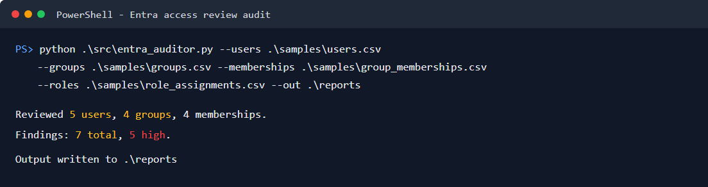
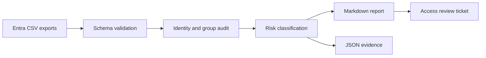

# Entra Access Review Auditor

[](https://github.com/vxti-glitch/entra-access-review-auditor/actions/workflows/python-tests.yml)


An offline Microsoft Entra ID access review helper for identifying stale accounts, risky guests, ownerless groups, and privileged role review candidates from CSV exports.

The project is designed for help desk and junior IAM portfolio demos. It can run entirely against sample data, but also includes a PowerShell export script you can adapt in a Microsoft 365 developer tenant.



_Sample run using the included synthetic Contoso identity data._

## What it demonstrates

- Microsoft Entra ID access review concepts
- CSV-based audit workflows
- Stale user and guest identification
- Disabled licensed account detection
- Group owner hygiene checks
- Guest access review candidate detection
- Privileged role review candidate detection
- Markdown and JSON audit output
- Unit tests and GitHub Actions CI

## Workflow



## Quick start

```powershell
python .\src\entra_auditor.py `
  --users .\samples\users.csv `
  --groups .\samples\groups.csv `
  --memberships .\samples\group_memberships.csv `
  --roles .\samples\role_assignments.csv `
  --out .\reports
```

Use `--fail-on-high` in automation if high-risk access review candidates should fail the job.

Generated files:

- `reports/access-review-findings.json`
- `reports/access-review-findings.md`

See the checked-in [example access review report](docs/examples/access-review-findings.md) and [example JSON evidence](docs/examples/access-review-findings.json).

## Input files

### users.csv

Required columns:

- `id`
- `userPrincipalName`
- `displayName`
- `userType`
- `accountEnabled`
- `createdDateTime`
- `signInActivityLastSignInDateTime`
- `managerUserPrincipalName`
- `assignedLicenses`

### groups.csv

Required columns:

- `id`
- `displayName`
- `owners`
- `sensitivityLabel`

### group_memberships.csv

Required columns:

- `groupId`
- `memberId`
- `memberUserPrincipalName`
- `memberType`

### role_assignments.csv

Required columns:

- `roleName`
- `principalId`
- `principalUserPrincipalName`

## Security note

Do not publish real tenant exports. The included sample data is fake and safe for portfolio demonstration.

## Interview talking points

- Why stale access creates security and compliance risk
- Why ownerless groups are hard to govern
- Why disabled accounts with active licenses waste money
- How guest user reviews support least privilege
- How help desk teams can prepare clean escalation reports for IAM admins
